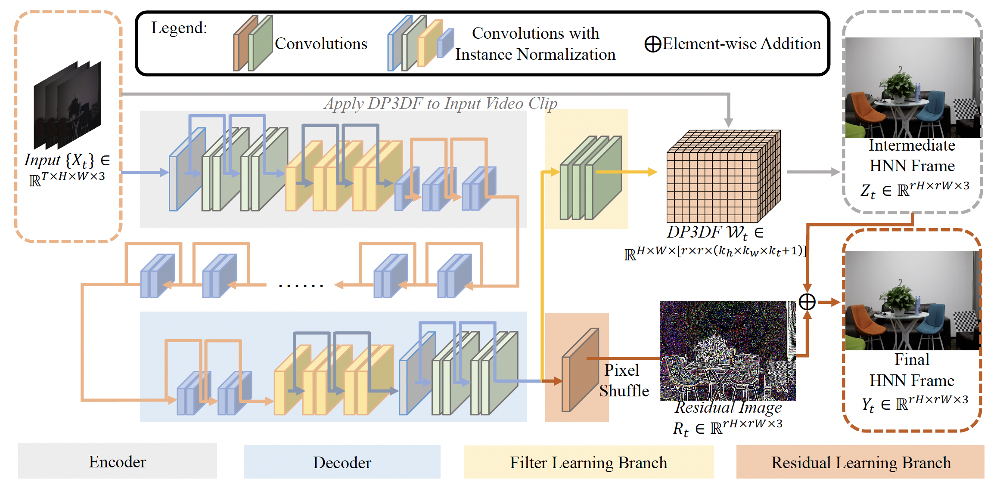

# Deep Parametric 3D Filters for Joint Video Denoising and Illumination Enhancement in Video Super Resolution

This is a pytorch project for the paper **Deep Parametric 3D Filters for Joint Video Denoising and Illumination Enhancement in Video Super Resolution** by Xiaogang Xu, Ruixing Wang, Chi-Wing Fu, and Jiaya Jia presented at **AAAI2023**.


## Introduction
This paper presents a new parametric representation called the Deep Parametric 3D Filters (DP3DF), which incorporates local spatiotemporal information to enable simultaneous denoising, illumination enhancement, 
and SR efficiently in a single encoder-and-decoder network. Also, a dynamic residual frame is jointly learned with the DP3DF via a shared backbone to further boost the SR quality.



[paper link](https://arxiv.org/abs/2207.01797)

## dataset
###SDSD dataset
Different from original SDSD datasets with dynamic scenes, we utilize its static version (the scenes are the same of original SDSD).
And you can download the SDSD-indoor and SDSD-outdoor from [baidu pan](https://pan.baidu.com/s/1rfRzshGNcL0MX5soRNuwTA) (验证码: jo1v) and [baidu pan](https://pan.baidu.com/s/1JzDQnFov-u6aBPPgjSzSxQ) (验证码: uibk) 
(the dataset can also be downloaded from [google pan](https://drive.google.com/drive/folders/1-fQGjzNcyVcBjo_3Us0yM5jDu0CKXXrV?usp=sharing)), and there should contain indoor_static_np and outdoor_static_np.

###SMID dataset
For SMID, we use its full images and also transfer the RAWdata to RGB, since our work explores low-light image enhancement in the RGB domain.
You can download our processed datasets for SMID from [baidu pan](https://pan.baidu.com/s/1Qol_4GsIjGDR8UT9IRZbBQ) (验证码: btux) 
(the dataset can also be downloaded from [google pan](https://drive.google.com/drive/folders/1OV4XgVhipsRqjbp8SYr-4Rpk3mPwvdvG?usp=sharing)), and there should contain "SMID_Long_np and SMID_LQ_np".

## Project Setup

First install Python 3. We advise you to install Python 3 and PyTorch with Anaconda:

```
conda create --name py36 python=3.6
source activate py36
```

Clone the repo and install the complementary requirements:
```
cd $HOME
git clone --recursive git@github.com:xiaogang00/DP3DF.git
cd DP3DF
pip install -r requirements.txt
```

## Usage

### Train
Train the model on the corresponding dataset using the train config.

The training on indoor subset of SDSD:
```
python -m torch.distributed.launch --nproc_per_node 1 --master_port 4328 train.py -opt options/train/SDSD_indoor.yml --launcher pytorch
```

The training on outdoor subset of SDSD:
```
python -m torch.distributed.launch --nproc_per_node 1 --master_port 4332 train.py -opt options/train/SDSD_outdoor.yml --launcher pytorch
```

The training on SMID:
```
python -m torch.distributed.launch --nproc_per_node 1 --master_port 4317 train.py -opt options/train/SMID.yml --launcher pytorch
```

If you want to resume the training, you should write **the location of checkpoint** in "pretrain_model_G" and **the path of the saved training state** in ``resume_state" of config file (e.g., options/test/SDSD_indoor.yml).

### Test

We use PSNR and SSIM as the metrics for evaluation. Evaluate the model on the corresponding dataset using the test config.

For the evaluation on indoor subset of SDSD, you should write the location of checkpoint in ``pretrain_model_G" of options/test/SDSD_indoor.yml
use the following command line:
```
python test.py -opt options/test/SDSD_indoor.yml
```

For the evaluation on outdoor subset of SDSD, you should write the location of checkpoint in ``pretrain_model_G" of options/test/SDSD_outdoor.yml
use the following command line:
```
python test.py -opt options/test/SDSD_outdoor.yml
```

For the evaluation on SMID, you should write the location of checkpoint in ``pretrain_model_G" of options/test/SMID.yml
use the following command line:
```
python test.py -opt options/test/SMID.yml
```

### Pre-trained Model

You can download our trained model using the following links: https://drive.google.com/file/d/12Xtgpxt9Q-3oQDH4l_yONOWhm8lPr90Q/view?usp=share_link

the model trained with indoor subset in SDSD: indoor_G.pth
the model trained with outdoor subset in SDSD: outdoor_G.pth
the model trained with SMID: smid_G.pth

## Citation Information

If you find the project useful, please cite:

```
@inproceedings{xu2023dp3df,
  title={Deep Parametric 3D Filters for Joint Video Denoising and Illumination Enhancement in Video Super Resolution},
  author={Xiaogang Xu, Ruixing Wang, Chi-Wing Fu, and Jiaya Jia},
  booktitle={AAAI},
  year={2023}
}
```


## Acknowledgments
This source code is inspired by [EDVR](https://github.com/xinntao/EDVR).

## Contributions
If you have any questions/comments/bug reports, feel free to e-mail the author Xiaogang Xu ([xiaogangxu00@gmail.com](xiaogangxu00@gmail.com)).
